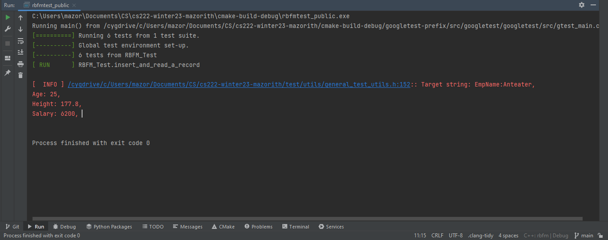
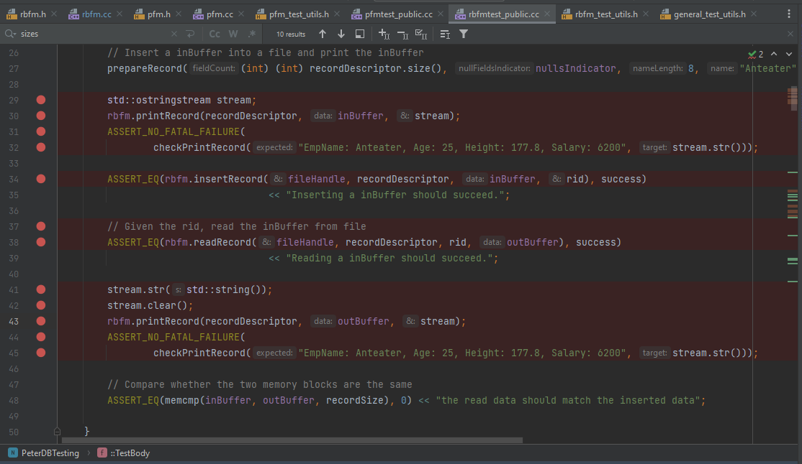
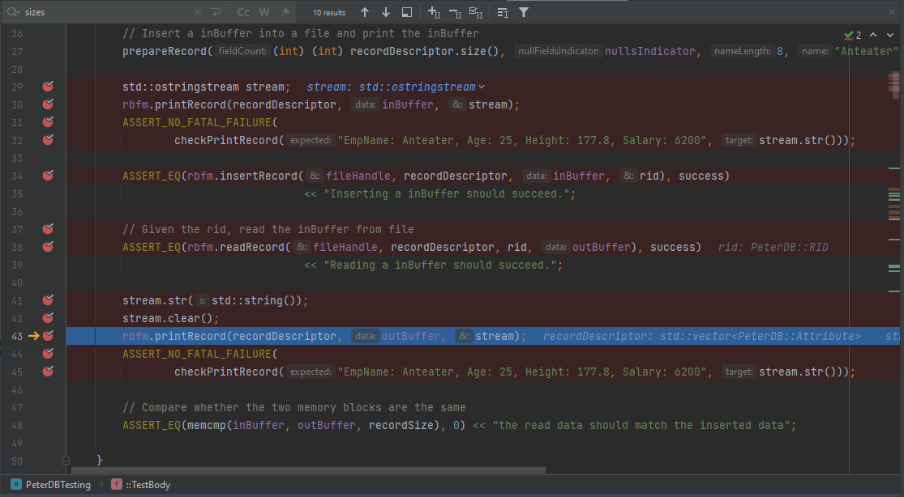
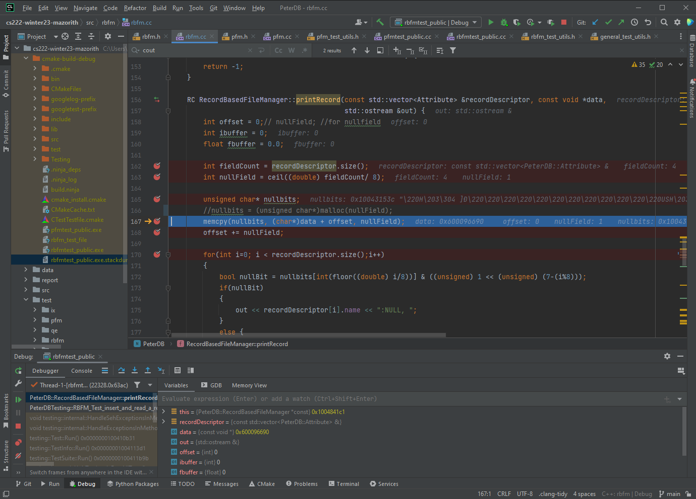
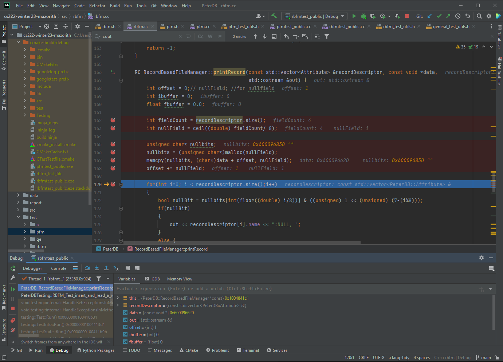
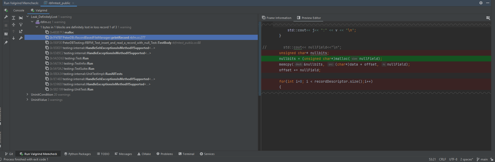

## Debugger and Valgrind Report

### 1. Basic information
 - Team #:
 - Github Repo Link: https://github.com/mazorith/CS222-DB.git
 - Student 1 UCI NetID: 85845302
 - Student 1 Name: Ian Harshbarger

I have taken this class before partially. I was unable to complete all the work and need to retake this course.
I am using my work from last year for the using a debugger section as it is still applicable to what I am and have 
used it for.  

### 2. Using a Debugger

- Describe how you use a debugger (gdb, or lldb, or CLion debugger) to debug your code and show screenshots.
  For example, using breakpoints, step in/step out/step over, evaluate expressions, etc.

I used the CLion debugger constantly. Most of the time when I ran into errors, they were runtime and not explicit, 
aside from an generic exit code. The blatantly obvious reason for this is that I had bad memory allocation and bad type 
conversions but, since I didn't know where exactly my errors were I would first set up breakpoints within the testing 
files for the pfm and rbfm test to pinpoint where the in a particular test I was failing.

From there I would trace the member function implementation that is causing the error and set up some breakpoints 
throughout that function as well.

From this point on it become a game of looking through various variables values as I stepped through each breakpoint 
to identify which ones are behaving incorrectly so I can fix them. Here the first memcpy of printRecord is causing a 
seg fault.

in this case I ran into the error previously so once I uncomment the char buffer allocation for the nullfield everything works just fine!

### 3. Using Valgrind
- Describe how you use Valgrind to detect memory leaks and other problems in your code and show screenshot of the Valgrind report.

I find valgrind more useful for when most of an implementation is completed and needs to more advanced debugging. 
Since a few parts of my code are unfinished and I am trying to track down specific errors with the debug tool. 
I have not yet needed to fully utilize valgrind, but I can run it and identify a few memory leaks I currently have.

The current memory leeks are due to the fact that my project is currently failing in any test where I need to use the print 
functionality of my rbmf. For some reason the memory allocation of the null buffer initalization is constantly causing a 
segmentation fault. I don't know why since this bit of code is running perfectly in both the insert and read functions 